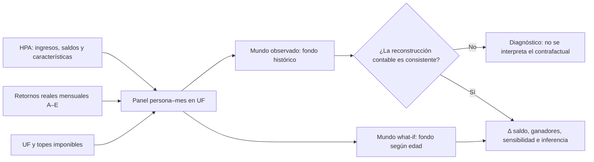

# Gemelo Digital Previsional · Ciencia2030

[](https://www.python.org/)
[](https://github.com/javiertapia01/Ciencia2030-gemelo-digital-/actions/workflows/tests.yml)
[](#estado-actual-del-experimento)

Este repositorio implementa el primer experimento del gemelo digital previsional de Ciencia2030: comparar, para una misma persona y bajo exactamente las mismas condiciones económicas, dos formas de asignar sus ahorros previsionales a los fondos A–E.

> **Pregunta del experimento:** ¿cómo habría cambiado el saldo acumulado si la persona hubiese seguido una asignación generacional automática por edad, en vez de la trayectoria de Multifondos observada?

No es un predictor ni una simulación aleatoria. Es una reconstrucción contable determinista, reproducible y auditable.

## Qué podemos hacer con el gemelo

| Capacidad | Qué entrega al equipo |
|---|---|
| Reconstruir historias previsionales | Panel mensual en UF, con remuneración agregada sobre todos los pagadores, cotización, saldo y fondo observado. |
| Comparar dos mundos | Trayectorias paralelas `Multifondos observado` vs. `asignación generacional por edad`, cambiando únicamente el fondo. |
| Evitar resultados engañosos | Un **gate contable obligatorio** bloquea el contrafactual si la reconstrucción observada no reproduce razonablemente los saldos reportados. |
| Probar reglas alternativas | Escenario base y transiciones etarias desplazadas ±5 años. |
| Medir ganadores y perdedores | Diferencia final en UF y %, fracción con mejora, distribuciones y trayectorias completas. |
| Cuantificar incertidumbre | Wilcoxon pareado y bootstrap remuestreando personas completas. |
| Entender heterogeneidad | Resultados por edad, ingreso, densidad de cotización, sexo, AFP y fondo predominante; OLS con errores HC3. |
| Auditar cada corrida | Configuración, fuentes, hashes SHA-256, exclusiones, calidad de datos y estado metodológico. |

## El experimento en una imagen



Ambos mundos usan la misma identidad:

\[
B_{i,t+1}=(B_{i,t}+C_{i,t})(1+r_{F_{i,t},t})
\]

La única variable que cambia es `Fondo observado → Fondo asignado según edad`.

## Regla generacional implementada

La regla base usa los fondos históricos A–E como proxies de una trayectoria de riesgo decreciente:

| Edad | Fondo proxy |
|---:|:---:|
| Menos de 35 | A |
| 35–44 | B |
| 45–54 | C |
| 55–64 | D |
| 65 o más | E |

Esta es una **regla contrafactual del experimento**, no una reconstrucción de los Fondos Generacionales regulatorios definitivos. Los cortes son configurables y se someten a sensibilidad.

## Estado actual del experimento

El software está implementado y probado. En una corrida reproducible de diagnóstico sobre 100 afiliados:

- 83 personas tuvieron una historia continua elegible;
- se evaluaron 11.565 comparaciones persona–mes;
- la mediana global del error absoluto fue 6,7%;
- el error absoluto mediano de los últimos 12 meses alcanzó 30,1%;
- se detectó una deriva de 2,6 puntos porcentuales por año.

Por eso el resultado correcto fue **`gate_closed`**: el sistema no publicó diferencias contrafactuales. Esto demuestra que el control metodológico funciona y que todavía debemos explicar flujos omitidos —por ejemplo, pensión/fallecimiento, retiros, movimientos CCICO o timing de acreditación— antes de presentar impactos finales.

## Experimentos toy: resultados demostrativos

Para mostrar qué información entregará el gemelo cuando el gate esté abierto, el repositorio incluye una cohorte **100% sintética** de 800 personas y un mercado determinista de 10 años. Esta demo no usa HPA, no estima la reforma real y no debe interpretarse como evidencia empírica.

```bash
gemelo-previsional toy --output-dir examples/toy --people 800 --months 120 --seed 2030
```

La corrida reproduce exactamente el mundo observado por construcción (`error máximo = 0 UF`) y luego compara tres calendarios de transición:

| Experimento | Resultado toy | Qué permite observar |
|---|---:|---|
| Tres trayectorias individuales | `+27,3`, `−76,8` y `−175,3 UF` al año 10 | El efecto depende de la edad inicial, el saldo y el momento en que cambia el riesgo. |
| Cohorte, escenario base | Mediana `−11,8 UF` (`−2,3%`); `26,5%` termina con mayor saldo | La distribución completa revela heterogeneidad que el promedio oculta. |
| Transición 5 años antes | Mediana `−21,9 UF`; `16,6%` con mayor saldo | Adelantar el calendario aumenta la exposición a la regla durante el horizonte. |
| Transición 5 años después | Mediana `0,0 UF`; `46,6%` con mayor saldo | Postergar la transición reduce el contraste entre ambos mundos. |

Los CSV y el resumen JSON reproducibles están documentados en [`examples/toy/README.md`](examples/toy/README.md).


## Demo rápida para el equipo

### 1. Clonar y preparar el entorno

```bash
git clone https://github.com/javiertapia01/Ciencia2030-gemelo-digital-.git
cd Ciencia2030-gemelo-digital-
python -m venv .venv
```

Activación:

```bash
# macOS/Linux
source .venv/bin/activate

# Windows PowerShell
.venv\Scripts\Activate.ps1
```

Instalación:

```bash
python -m pip install -e .
```

### 2. Ejecutar las pruebas sin datos confidenciales

```bash
python -m unittest discover -s tests -v
```

Las pruebas sintéticas verifican los cortes etarios, el aporte al comienzo del mes, la conversión de unidades, el tope imponible, la recursión paralela, el gate, Wilcoxon, el bootstrap reproducible y la demo toy.

### 3. Conectar los datos del proyecto

Los datos HPA **no están incluidos en GitHub**. Cada integrante autorizado debe disponer localmente de:

- `hpa.zip`, sin descomprimir;
- el consolidado de rentabilidades `base_de_datos_fondos_pensiones.xlsx`;
- `data/external/parameters_2008_2025.csv`, que sí está versionado porque contiene parámetros públicos.

Copien la configuración de ejemplo y adapten únicamente las rutas:

```bash
cp config/experiment.example.json config/experiment.local.json
```

`config/*.local.json` está ignorado por Git para que las rutas personales no se publiquen.

### 4. Correr primero una muestra

```bash
gemelo-previsional run \
  --config config/experiment.local.json \
  --sample-size 100 \
  --output-dir output/runs/demo_100
```

En PowerShell se puede escribir en una sola línea:

```powershell
gemelo-previsional run --config config/experiment.local.json --sample-size 100 --output-dir output/runs/demo_100
```

Solo después de resolver el gate corresponde retirar `--sample-size` para ejecutar el panel completo.

## Qué produce una corrida

Siempre se generan archivos de validación:

| Salida | Uso |
|---|---|
| `run_manifest.json` | Configuración, hashes, versión y estado metodológico. |
| `data_quality.json` | Cobertura, pagadores, meses sin ingreso, traspasos y concordancia del tope. |
| `validation_summary.json` | Resultado y umbrales del gate. |
| `validation_errors_by_month.csv` | Evolución temporal del error contable. |
| `manual_trajectories.csv` | 30 historias para revisión individual. |
| `exclusions.csv` | Personas fuera del análisis y motivo. |

Si el gate pasa, además se habilitan:

- `individual_results.csv`;
- `population_summary.json`;
- `sensitivity_summary.csv`;
- `stratification.csv`;
- `regression_ols_hc3.csv`.

Si el gate falla, aparece `GATE_CLOSED.md` y no se exportan columnas ni métricas what-if. La opción `--force-counterfactual` existe solo para depuración y marca los resultados como **no interpretables**.

## Estructura del repositorio

```text
├── config/                         # Configuración base y ejemplo local
├── data/external/                  # UF y topes públicos con URL por fila
├── docs/                           # Metodología y contratos de datos
├── examples/toy/                   # Resultados sintéticos reproducibles
├── scripts/                        # Descarga reproducible de parámetros públicos
├── src/gemelo_previsional/         # Motor del gemelo digital
├── tests/                          # Pruebas sintéticas y deterministas
├── pyproject.toml                  # Paquete y comando de consola
└── README.md
```

Los ZIP, datos HPA, archivos temporales y resultados con identificadores están excluidos mediante `.gitignore`.

## Cómo presentar el proyecto en 5 minutos

1. **Problema:** no conocemos el efecto puro de cambiar la asignación de fondos.
2. **Diseño:** misma persona, mismos ingresos, cotizaciones y mercado; cambia solo el fondo.
3. **Demostración:** ejecutar `gemelo-previsional toy` y mostrar trayectorias, distribución y sensibilidad.
4. **Control de realidad:** mostrar el manifiesto y el gate cerrado de la muestra HPA.
5. **Hallazgo actual:** la demo explica las salidas posibles, pero la contabilidad HPA aún exhibe deriva y no corresponde interpretar su what-if.
6. **Valor del gemelo:** hace explícito qué falta, evita conclusiones prematuras y deja preparado el análisis final una vez corregida la reconstrucción.

## Próximos pasos del equipo

- diagnosticar el error por edad, estado previsional, densidad y fecha;
- censurar o modelar eventos de pensión, fallecimiento y retiros;
- contrastar alternativas de timing para la acreditación de cotizaciones;
- volver a calibrar el gate sin relajar los criterios para “hacerlo pasar”;
- ejecutar el panel completo únicamente después de validar 20–30 trayectorias individuales;
- incorporar en una Etapa 2 la reforma completa y parámetros regulatorios definitivos.

## Documentación técnica

- [Metodología implementada](docs/METHODOLOGY.md)
- [Contratos de datos y salidas](docs/DATA_CONTRACTS.md)
- [Configuración de ejemplo](config/experiment.example.json)
- [Script reproducible de UF y topes](scripts/fetch_external_parameters.py)

## Fuentes y confidencialidad

La UF proviene de las tablas oficiales del Servicio de Impuestos Internos y los topes de la Superintendencia de Pensiones. Cada fila del CSV público conserva las URL utilizadas.

La HPA es una base longitudinal con montos redondeados y no debe compartirse en este repositorio. Los resultados individuales también permanecen fuera de Git. Este proyecto no produce estimaciones representativas del universo nacional porque la muestra no posee factores de expansión.
