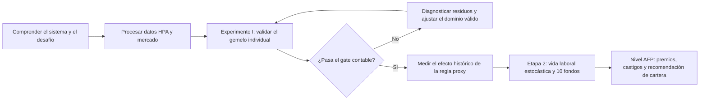
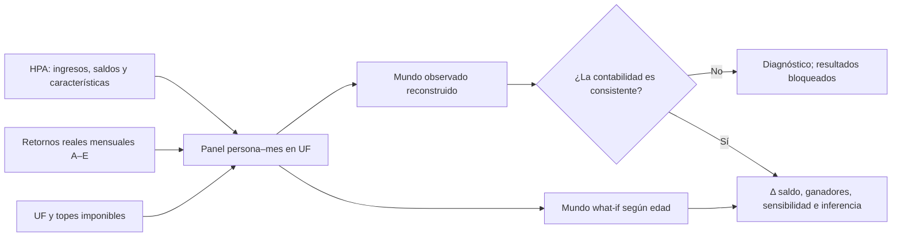
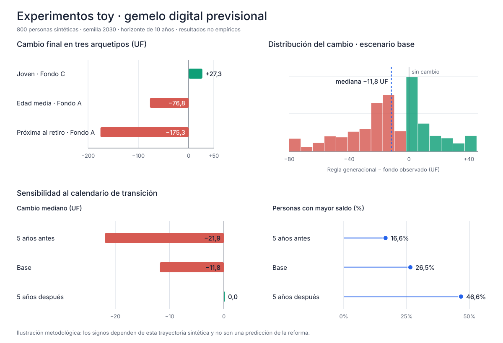
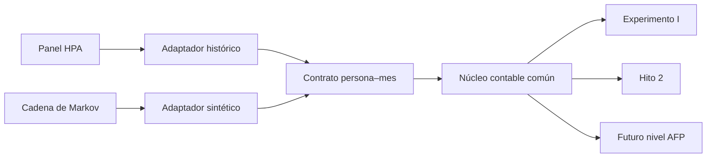

# Gemelo Digital Previsional · Ciencia2030

[](https://www.python.org/)
[](https://github.com/javiertapia01/Ciencia2030-gemelo-digital-/actions/workflows/tests.yml)
[](#estado-actual)

> Proyecto desarrollado como parte del **Desafío Ciencia en Acción UC de Ciencia 2030**, sobre Fondos Generacionales, gestión de riesgo y el mecanismo de premios y castigos del sistema previsional chileno.

## En una frase

Este repositorio construye un gemelo digital previsional en dos capas individuales: un laboratorio contrafactual con historias reales anonimizadas y una simulación estocástica de vidas laborales sintéticas hasta la jubilación.

## Motivación dentro del taller

El desafío general del taller propone asesorar al área de inversiones de una AFP sobre cómo administrar los nuevos Fondos Generacionales frente a la incertidumbre del mercado y de las trayectorias laborales, minimizando el riesgo de castigos sin sacrificar competitividad.

La ficha del desafío organiza ese problema en dos niveles:

1. **Nivel individual:** representar cómo cotizaciones, lagunas y rentabilidad forman la trayectoria de ahorro de una persona.
2. **Nivel AFP:** agregar muchas trayectorias, simular los diez Fondos Generacionales y evaluar decisiones de cartera, benchmarks, premios y castigos.

El material de consultoría del taller propone avanzar en el ciclo `identificar → procesar datos → desarrollar y validar → resolver → recomendar`. Este repositorio se concentra deliberadamente en la base del ciclo: entender los datos, construir el caso base y validar el nivel individual antes de escalar.

La propuesta original permite comenzar directamente con vidas sintéticas y Monte Carlo. Nuestro equipo incorpora antes un paso empírico adicional: aprovechar las Historias Previsionales de Afiliados (HPA) para comprobar si el motor puede reproducir trayectorias históricas y aislar el efecto puro de la asignación de fondos. Esto no es un desvío del taller; fortalece la calibración, la validación y la defensa posterior de cualquier recomendación.

## Meta actual del equipo

> **Para las personas observadas en la HPA, ¿cómo habría cambiado su saldo histórico si, manteniendo exactamente sus ingresos, cotizaciones y mercado, hubieran seguido nuestra regla generacional proxy A–E?**

Esta pregunta es la meta de corto plazo y define el **Experimento I**. Toda funcionalidad nueva debe contribuir a responderla de manera reproducible, auditable y comunicable.

La afirmación que buscamos estar en condiciones de formular es:

> Para las personas HPA con trayectorias contablemente reconstruibles, durante un periodo histórico definido y bajo los mismos ingresos, cotizaciones reconstruidas y retornos de mercado, la regla generacional proxy habría cambiado sus saldos en la distribución que reporta el experimento.

No buscamos todavía afirmar cuál será el efecto completo de la reforma ni recomendar una cartera óptima para una AFP.

## Qué es el Experimento I

El experimento aplica dos veces la misma identidad contable mensual:

\[
B_{i,t+1}=(B_{i,t}+C_{i,t})(1+r_{F_{i,t},t})
\]

Para una misma persona se construyen dos mundos paralelos:

| Elemento | Mundo observado reconstruido | Mundo contrafactual |
|---|---|---|
| Persona | La misma | La misma |
| Ingreso mensual | HPA | El mismo ingreso HPA |
| Cotización | Derivada con la misma tasa y tope | La misma cotización |
| Mercado | Retornos históricos A–E | Los mismos retornos históricos |
| Saldo inicial | Saldo HPA | El mismo saldo inicial |
| Asignación de fondo | Fondo observado en HPA | Fondo proxy definido por edad |

La única variable de tratamiento es:

\[
F^{OBS}_{i,t}\longrightarrow F^{WI}_{i,t}=f(edad_{i,t})
\]

Por eso el efecto estimado es:

\[
\Delta B_i=B_i(\text{regla generacional proxy})-B_i(\text{Multifondos observado})
\]

### Por qué comenzar por este experimento

- Aísla una sola decisión y facilita explicar de dónde proviene el resultado.
- Usa a cada persona como su propio control.
- Establece un caso base antes de introducir desempleo simulado, mercados futuros o decisiones de cartera.
- Obliga a validar la contabilidad con saldos observados.
- Permite detectar limitaciones de los datos antes de escalar al nivel AFP.
- Produce resultados visuales y discutibles por el equipo sin confundirlos con una predicción de la reforma.

## Qué no es el Experimento I

| No es | Por qué |
|---|---|
| Una predicción de pensiones futuras | Trabaja con un mercado histórico ya observado. |
| Una evaluación completa de la Ley N° 21.735 | La cotización patronal, Seguro Social y otros componentes quedan para etapas posteriores. |
| Una reconstrucción de los diez Fondos Generacionales | Usa A–E como proxies históricos de riesgo decreciente. |
| Un modelo Monte Carlo | Es determinista: mismas entradas producen exactamente las mismas salidas. |
| Una estimación nacional | La HPA es una muestra longitudinal sin factores de expansión disponibles para este análisis. |
| Una recomendación de inversión para una AFP | Primero se debe validar el nivel individual; la decisión de cartera pertenece al nivel AFP. |

## Lugar del repositorio en el desafío



El repositorio implementa actualmente los bloques de datos, Experimento I, gate y análisis histórico, además de una primera versión sintética de la vida laboral estocástica. Los diez Fondos Generacionales, el nivel AFP, la optimización y la recomendación siguen siendo extensiones posteriores.

## Criterio de éxito de corto plazo

Consideraremos terminado el Experimento I cuando se cumplan simultáneamente estas condiciones:

1. La reconstrucción observada pasa umbrales contables fijados antes de interpretar el contrafactual.
2. La validación se mantiene en personas y periodos no utilizados para ajustar convenciones.
3. No existe deriva sistemática del error en el tiempo.
4. Las exclusiones están automatizadas, justificadas y cuantificadas.
5. Se revisan manualmente trayectorias de distintos perfiles, no solo casos favorables.
6. Se ejecutan el escenario base y las sensibilidades de cortes etarios ±5 años.
7. Se reportan distribuciones completas, heterogeneidad e incertidumbre muestral.
8. El equipo puede explicar los supuestos, reproducir la corrida y defender el rango de validez.

El éxito no se define por obtener un efecto positivo. Un efecto negativo, heterogéneo o cercano a cero también es un resultado válido si la reconstrucción es consistente.

## Cómo funciona el gemelo implementado



### Regla generacional proxy

| Edad | Fondo proxy |
|---:|:---:|
| Menos de 35 | A |
| 35–44 | B |
| 45–54 | C |
| 55–64 | D |
| 65 o más | E |

El mapeo aproxima una trayectoria de riesgo decreciente usando fondos históricos. Es un parámetro experimental, no un hecho observado ni la regulación definitiva. Por eso se repite el análisis desplazando todos los cortes cinco años antes y cinco años después.

## Datos que motivan esta estrategia

Los archivos entregados en el taller permiten construir una primera capa individual especialmente rica:

| Fuente | Cobertura relevante | Uso en el Experimento I |
|---|---:|---|
| Características HPA | 32.877 personas | Edad, sexo, AFP, región y fechas previsionales. |
| Cotización obligatoria | 5,6 millones de filas | Remuneración imponible y multiplicidad de pagadores. |
| Saldos mensuales | 7,6 millones de filas | Saldo CCICO por fondo A–E entre 2008 y 2025. |
| Retornos mensuales | Fondos A–E | Mercado histórico común para ambos mundos. |
| UF y tope imponible | Serie mensual | Unidades consistentes y cotización derivada. |

Su principal fortaleza es la profundidad longitudinal. Sus principales limitaciones son el redondeo por confidencialidad, las fechas mensuales, los vacíos con significados distintos, la ausencia del depósito efectivo de cotización y la falta de Fondos Generacionales observados.

## Estado actual

| Componente | Estado |
|---|---|
| Ingesta y contratos de datos | Implementado |
| Panel mensual en UF | Implementado |
| Motor contable paralelo | Implementado y probado |
| Núcleo persona–mes compartido HPA/Markov | Implementado y probado |
| Regla base y sensibilidades | Implementadas |
| Gate contable obligatorio | Implementado |
| Diagnóstico mensual de un paso | Implementado y evaluado en muestra de 100 personas |
| Inferencia y estratificación | Implementadas, bloqueadas hasta pasar el gate |
| Demo toy sin datos confidenciales | Implementada |
| Validación empírica HPA | En diagnóstico |
| Hito 2: nivel individual estocástico | Implementado en primera versión sintética |
| Nivel AFP | No iniciado en este repositorio |

En una corrida reproducible de diagnóstico sobre 100 personas seleccionadas:

- 83 tuvieron una historia continua elegible;
- se evaluaron 11.565 transiciones persona–mes;
- la mediana global del error absoluto fue 6,7%;
- la mediana del error absoluto en los últimos 12 meses fue 30,1%;
- la deriva anual del error fue 2,6 puntos porcentuales.

El resultado metodológicamente correcto fue **`gate_closed`**. El sistema no publicó diferencias contrafactuales HPA. Esto muestra que el control funciona: todavía no corresponde presentar ganadores, pérdidas o un efecto promedio con datos reales.

Sobre la misma selección reproducible, el nuevo diagnóstico comparó 24 convenciones en 11.514 transiciones comunes. La variante elegida únicamente con calibración fue cotización del mes actual al final del periodo y retorno del mes siguiente ponderado por saldos A–E. Su mediana de residuo relativo absoluto fue 0,45% en calibración y 0,32% en validación, frente a 2,11% y 1,93% de la convención base. En validación, el percentil 90 fue 2,79%, pero 2,6% de las transiciones todavía superó 10% y permanecen casos extremos asociados a caídas abruptas de saldo.

Este resultado identifica una convención temporal prometedora; no autoriza reemplazarla automáticamente en el motor. Primero deben explicarse los casos extremos y luego repetirse el gate acumulativo fuera de calibración.

## Diagnóstico contable de un paso

Para explicar por qué la reconstrucción se separa del saldo reportado, cada corrida calcula además un diagnóstico mensual de un paso:

\[
R_{i,t}=B^{reportado}_{i,t+1}-(B^{reportado}_{i,t}+C_{i,t})(1+r_{i,t})
\]

Este residuo parte nuevamente del saldo reportado en cada transición, por lo que permite localizar el primer mes problemático sin arrastrar errores acumulados. No reemplaza el gate acumulativo ni lo abre automáticamente.

El diagnóstico implementado compara 24 variantes formadas por:

- cotización del mes anterior, actual o siguiente;
- cotización al comienzo o al final de la aplicación del retorno;
- composición y retorno del mes actual versus el mes siguiente;
- fondo dominante versus retorno ponderado por los saldos positivos A–E.

También informa por separado:

- meses normales versus meses con más de un fondo;
- periodos de acumulación versus periodos cercanos a pensión o fallecimiento;
- errores por edad, AFP, fondo, año, densidad y remuneración.

Las personas se asignan de forma determinista y sin solapamiento a calibración o validación. La variante se elige solo por la menor mediana del residuo relativo absoluto en calibración y luego se reporta congelada en validación. Nunca se elige según qué configuración produzca el resultado contrafactual más atractivo.

El próximo paso empírico es clasificar las caídas abruptas y demás casos extremos, revisar sus trayectorias y determinar si corresponden a retiros, pagos, movimientos administrativos u otra ruptura del dominio contable. Solo después corresponde decidir si la evidencia justifica modificar una convención del motor. Cualquier modificación exige repetir el gate acumulativo en personas no usadas para calibrar.

## Qué entregará el experimento cuando el gate pase

| Pregunta del equipo | Salida |
|---|---|
| ¿Cuánto cambia el saldo? | Diferencia final en UF y porcentaje. |
| ¿Cuándo aparece la diferencia? | Trayectoria mensual de ambos mundos. |
| ¿A cuántas personas favorece? | Fracción con `Δ saldo > 0`. |
| ¿El promedio esconde dispersión? | Histograma, cuantiles y ECDF. |
| ¿Quiénes son más sensibles? | Resultados por edad, ingreso, densidad, sexo, AFP y fondo predominante. |
| ¿Depende de los cortes etarios? | Comparación base, cinco años antes y cinco años después. |
| ¿Qué tan precisa es la estimación muestral? | Bootstrap por persona y Wilcoxon pareado. |
| ¿Dónde deja de ser válido? | Gate, exclusiones, sensibilidad y limitaciones explícitas. |

### Lenguaje correcto para comunicar los resultados

| Formulación correcta | Formulación que debemos evitar |
|---|---|
| “En la muestra HPA elegible, bajo esta regla proxy e historia de mercado…” | “La reforma aumentará las pensiones de Chile en…” |
| “El efecto histórico condicionado fue…” | “Este es el retorno futuro de los Fondos Generacionales”. |
| “Los resultados toy muestran el tipo de salida posible”. | “Los resultados toy demuestran quién gana con la reforma”. |
| “El resultado es válido bajo estos supuestos y exclusiones”. | “El gemelo reproduce toda la realidad previsional”. |

## Demo toy para comprender las salidas

La demo sintética existe para que el equipo pueda explorar la herramienta mientras el gate HPA permanece cerrado. Usa 800 personas artificiales, un mercado determinista de 10 años y no contiene información confidencial.

```bash
gemelo-previsional toy --output-dir examples/toy --people 800 --months 120 --seed 2030
```

Resultados ilustrativos del escenario construido:

| Experimento | Resultado toy | Qué permite observar |
|---|---:|---|
| Tres arquetipos | `+27,3`, `−76,8` y `−175,3 UF` | La heterogeneidad individual. |
| Cohorte base | Mediana `−11,8 UF`; `26,5%` con mayor saldo | La distribución de ganadores y perdedores. |
| Transición anticipada | Mediana `−21,9 UF` | Sensibilidad al calendario. |
| Transición postergada | Mediana `0,0 UF` | Dependencia del horizonte de exposición. |



Estos valores son correctos dentro de la simulación, pero no describen la HPA ni la reforma. Los archivos reproducibles se encuentran en [`examples/toy/`](examples/toy/README.md).

## Hito 2: vida laboral estocástica

La primera versión del segundo hito simula una vida previsional completa entre los 25 y 65 años mediante una cadena de Markov mensual. Compara tres escenarios —estable, intermitente y adverso— con 2.000 caminos Monte Carlo por escenario.

Todos los escenarios comparten perfil inicial, salario potencial, mercado, semilla y regla proxy A–E. Solo cambian las probabilidades de transición entre `cotizando`, `desempleado`, `informal`, `licencia` e `invalidez`; por eso la comparación aísla el efecto de las trayectorias laborales bajo los supuestos declarados.

```powershell
gemelo-previsional hito2 --config config/hito2.json --output-dir examples/hito2
```

Los parámetros son supuestos de escenarios y no estimaciones HPA. La metodología, las limitaciones y los criterios de validación están en [`docs/MILESTONE2.md`](docs/MILESTONE2.md); los resultados reproducibles se encuentran en [`examples/hito2/`](examples/hito2/README.md).

### Integración entre Experimento I e Hito 2

Ambas rutas mantienen adaptadores separados, pero ahora usan el mismo núcleo contable vectorizado y el contrato persona–mes v1.0. El flujo HPA transforma observaciones históricas; el flujo Markov genera estados sintéticos. Después de esa diferencia, ambos representan persona, mes, estado, salario, cotización, fondo, retorno y saldos con las mismas columnas y validaciones.



La integración asegura coherencia computacional, pero no convierte los supuestos Markov en estimaciones HPA ni abre el gate contable. Consulte [`docs/INDIVIDUAL_CORE.md`](docs/INDIVIDUAL_CORE.md).

#### Cómo usar la integración

Las dos rutas se ejecutan con sus comandos habituales; la integración ocurre internamente y queda expuesta en archivos con el mismo esquema:

| Ruta | Comando | Salida bajo el contrato común |
|---|---|---|
| Hito 2 sintético | `gemelo-previsional hito2 --config config/hito2.json --output-dir examples/hito2` | `examples/hito2/hito2_person_month_contract.csv` |
| Experimento HPA | `gemelo-previsional run --config config/experiment.local.json --sample-size 100 --output-dir output/runs/integracion_hpa_100` | `output/runs/integracion_hpa_100/hpa_person_month_contract.csv` |

Ambos CSV contienen `source`, `person_id`, `period`, `age`, `labor_state`, `potential_wage_uf`, `contribution_uf`, `fund`, `monthly_return`, `opening_balance_uf` y `closing_balance_uf`. Esto permite comparar, auditar o agregar trayectorias sin confundir su procedencia.

Para comprobar específicamente la equivalencia de los dos adaptadores y el núcleo común:

```powershell
python -m unittest tests.test_individual_core -v
```

Para conectar una fuente nueva, se construye un `DataFrame` con las columnas de entrada del contrato y se delega el cierre mensual al núcleo:

```python
from gemelo_previsional.individual_core import post_person_month

person_month_with_closing_balance = post_person_month(person_month_inputs)
```

No se debe calcular `closing_balance_uf` por separado: `post_person_month` aplica y valida la misma identidad usada por HPA y Markov. Los datos HPA siguen requiriendo acceso autorizado y su `gate` continúa siendo obligatorio.

## Cómo colabora el equipo en este repositorio

El taller enfatiza que colaborar no es dividir partes aisladas y unirlas al final. Cada frente puede tener responsables, pero las decisiones metodológicas y el mensaje deben ser comprendidos por todo el grupo.

| Frente | Pregunta de responsabilidad compartida |
|---|---|
| Datos | ¿Qué representa realmente cada fila y cada ausencia? |
| Contabilidad | ¿La identidad y el calendario reproducen el saldo observado? |
| Metodología | ¿El estimando, gate y exclusiones responden a la meta? |
| Regulación | ¿Qué es proxy y qué proviene de normativa vigente? |
| Estadística | ¿La incertidumbre y heterogeneidad están bien comunicadas? |
| Visualización | ¿Una persona no técnica entiende qué compara el gráfico? |
| Recomendación | ¿Cada conclusión está respaldada por un resultado y declara su rango de validez? |

Para cada cambio importante conviene registrar:

1. alternativa considerada;
2. criterio de decisión: evidencia, impacto, factibilidad y riesgo;
3. supuesto que se modifica;
4. prueba que confirma el cambio;
5. efecto sobre lo que podemos comunicar.

## Hoja de ruta del taller

| Etapa | Pregunta | Producto esperado | Estado |
|---|---|---|---|
| Comprensión | ¿Cómo funcionan AFP, cuentas y reforma? | Ficha resumen y marco común | Realizada |
| Datos | ¿Qué evidencia tenemos y cómo se transforma? | Panel persona–mes auditable | Realizada |
| Experimento I | ¿Cuál es el efecto puro histórico de asignación? | Contrafactual HPA validado | Meta actual |
| Nivel individual estocástico | ¿Cómo cambian los resultados con distintas vidas laborales? | Al menos tres escenarios y Monte Carlo | Realizada, versión sintética v1 |
| Nivel AFP | ¿Cómo se agregan cotizantes y diez fondos? | Gemelo agregado y probabilidad de castigo | Etapa 2 |
| Optimización | ¿Qué estrategia equilibra riesgo, premio y castigo? | Sensibilidad y propuesta de cartera | Etapa 2 |
| Recomendación | ¿Qué debería hacer una AFP y bajo qué condiciones? | Informe y presentación final | Etapa 2 |

## Ejecutar el proyecto

### 1. Clonar y preparar el entorno

```bash
git clone https://github.com/javiertapia01/Ciencia2030-gemelo-digital-.git
cd Ciencia2030-gemelo-digital-
python -m venv .venv
```

Activar el entorno:

```bash
# macOS/Linux
source .venv/bin/activate

# Windows PowerShell
.venv\Scripts\Activate.ps1
```

Instalar:

```bash
python -m pip install -e .
```

### 2. Ejecutar las pruebas sin datos HPA

```bash
python -m unittest discover -s tests -v
```

Las pruebas verifican unidades, topes, cortes etarios, identidad contable, contribuciones iguales entre mundos, gate, inferencia reproducible, demo toy y reproducibilidad del Hito 2.

### Ejecutar el segundo hito

```powershell
gemelo-previsional hito2 --config config/hito2.json --output-dir examples/hito2
```

La semilla y el número de caminos se pueden sobrescribir con `--seed` y `--paths`. La configuración versionada contiene el perfil común y las matrices de transición completas.

### 3. Conectar los datos autorizados

Los datos HPA no están incluidos en GitHub. Cada integrante autorizado debe disponer localmente de:

- `hpa.zip`;
- `base_de_datos_fondos_pensiones.xlsx`;
- `data/external/parameters_2008_2025.csv`, versionado por contener parámetros públicos.

Copiar y adaptar la configuración:

```bash
cp config/experiment.example.json config/experiment.local.json
```

`config/*.local.json` está ignorado para evitar publicar rutas personales.

### 4. Ejecutar primero una muestra

```bash
gemelo-previsional run \
  --config config/experiment.local.json \
  --sample-size 100 \
  --output-dir output/runs/demo_100
```

En PowerShell:

```powershell
gemelo-previsional run --config config/experiment.local.json --sample-size 100 --output-dir output/runs/demo_100
```

Solo después de pasar el gate en una muestra de calibración y otra de validación corresponde ejecutar el panel completo.

## Salidas de una corrida HPA

Siempre se generan archivos de auditoría:

| Salida | Uso |
|---|---|
| `run_manifest.json` | Configuración, fuentes, hashes y estado metodológico. |
| `data_quality.json` | Cobertura, pagadores, brechas, fondos y topes. |
| `validation_summary.json` | Resultado y umbrales del gate. |
| `validation_errors_by_month.csv` | Evolución temporal del error contable. |
| `validation_errors_sample.csv` | Ejemplos de errores persona–mes. |
| `one_step_selection.json` | Variante elegida en calibración y métricas congeladas de validación. |
| `one_step_variant_summary.csv` | Comparación de las 24 convenciones por partición. |
| `one_step_residuals.csv` | Residuo mensual base y seleccionado; marca el primer error grande por persona. |
| `one_step_stratification.csv` | Errores de validación por año, edad, AFP, fondo, densidad y remuneración. |
| `manual_trajectories.csv` | Historias para revisión humana. |
| `exclusions.csv` | Personas excluidas y motivo. |

Solo si el gate pasa se habilitan:

- `individual_results.csv`;
- `population_summary.json`;
- `sensitivity_summary.csv`;
- `stratification.csv`;
- `regression_ols_hc3.csv`.

Si el gate falla se genera `GATE_CLOSED.md`. `--force-counterfactual` existe exclusivamente para depuración y mantiene los resultados marcados como no interpretables.

## Estructura del repositorio

```text
├── config/                         # Configuración del experimento
├── data/external/                  # UF y topes públicos trazables
├── docs/                           # Metodología y contratos de datos
├── examples/toy/                   # Demo sintética inicial
├── examples/hito2/                 # Monte Carlo de vidas laborales y resultados
├── scripts/                        # Preparación de parámetros públicos
├── src/gemelo_previsional/         # Motor del gemelo digital
├── tests/                          # Pruebas deterministas
├── pyproject.toml                  # Paquete y comando de consola
└── README.md                       # Meta compartida y guía del equipo
```

## Privacidad y rango de validez

- La HPA contiene información longitudinal anonimizada y no se publica en este repositorio.
- Los resultados individuales HPA permanecen fuera de Git.
- Los montos están redondeados y las fechas tienen precisión mensual.
- La muestra no se expande al universo nacional.
- Los fondos A–E son proxies y no los Fondos Generacionales definitivos.
- El Experimento I mide saldo CCICO; no estima todavía la pensión total.
- Una asociación o diferencia dentro del modelo no autoriza por sí sola una recomendación sobre la reforma.

## Documentación técnica

- [Metodología implementada](docs/METHODOLOGY.md)
- [Núcleo individual y contrato persona–mes](docs/INDIVIDUAL_CORE.md)
- [Metodología del Hito 2](docs/MILESTONE2.md)
- [Contratos de datos y salidas](docs/DATA_CONTRACTS.md)
- [Configuración de ejemplo](config/experiment.example.json)
- [Demo toy](examples/toy/README.md)
- [Parámetros públicos](scripts/fetch_external_parameters.py)

## Regla de trabajo del proyecto

> Primero comprender y validar; después resolver; finalmente recomendar. Ningún resultado se presenta sin explicar qué compara, qué supone y dónde deja de ser válido.
