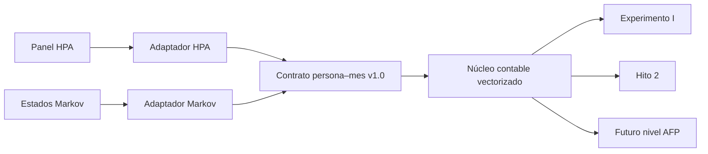

# Núcleo individual compartido

## Propósito

El Experimento I y el Hito 2 mantienen fuentes y objetivos distintos, pero comparten una única identidad contable y un contrato persona–mes. La integración evita que el motor histórico y el sintético diverjan silenciosamente sin hacer que uno dependa metodológicamente del otro.

## Contrato persona–mes v1.0

| Columna | Significado |
|---|---|
| `source` | Procedencia y mundo del registro. |
| `person_id` | Identificador de persona o camino sintético. |
| `period` | Mes histórico o índice mensual sintético. |
| `age` | Edad al comienzo del mes. |
| `labor_state` | Estado laboral observable o simulado. |
| `potential_wage_uf` | Remuneración potencial mensual en UF. |
| `contribution_uf` | Cotización aplicada al comienzo del mes. |
| `fund` | Fondo A–E observado o asignado por la proxy. |
| `monthly_return` | Retorno mensual del fondo seleccionado, en tanto por uno. |
| `opening_balance_uf` | Saldo al comienzo del paso contable. |
| `closing_balance_uf` | Saldo producido por la identidad compartida. |

La clave es `source/person_id/period`. El contrato exige valores finitos, saldos y cotizaciones no negativos, retornos mayores que −100% y fondos A–E.

## Núcleo contable

`individual_core.accounting_step_vectorized` implementa para escalares y arreglos:

\[
B_{t+1}=(B_t+C_t)(1+r_t)
\]

`model.accounting_step`, usado por el flujo HPA, delega en esta función. El simulador Markov la invoca directamente sobre todos sus caminos de un mes. Por ello, entradas idénticas producen exactamente el mismo saldo en ambos motores.

## Adaptador HPA

`hpa_adapter.adapt_hpa_panel_to_person_month` traduce nombres y convenciones históricas al contrato:

- `correl` pasa a `person_id`;
- una cotización positiva se etiqueta `cotizando`; el resto, `sin_cotizar`;
- el fondo puede ser el observado o la asignación generacional proxy;
- el retorno se selecciona desde `return_A` … `return_E`;
- `balance_uf` es el saldo de apertura del diagnóstico de un paso.

La corrida HPA exporta una muestra reproducible como `hpa_person_month_contract.csv`. Esta muestra es para auditoría del contrato y no reemplaza el gate acumulativo ni autoriza el contrafactual.

## Adaptador Markov

`markov_adapter` mantiene separados los estados, matrices y sorteos del Hito 2. También transforma las trayectorias representativas al mismo contrato y las exporta como `hito2_person_month_contract.csv`.

La diferencia entre adaptadores es deliberada: HPA observa cotización y remuneración, mientras Markov genera estados como desempleo, informalidad, licencia e invalidez. La capa compartida comienza después de decidir el estado, la cotización, el fondo y el retorno del mes.

## Garantías de regresión

Las pruebas automatizadas verifican:

1. equivalencia escalar y vectorial del núcleo;
2. que HPA y Markov importan la misma función contable;
3. que ambos adaptadores producen el mismo cierre ante entradas idénticas;
4. que el contrato rechaza cierres incompatibles con la identidad;
5. que las pruebas y salidas anteriores siguen disponibles.

## Límites

Compartir el núcleo no calibra automáticamente las transiciones Markov, no abre el gate HPA y no convierte A–E en los diez Fondos Generacionales. La integración asegura coherencia computacional; la validez empírica sigue dependiendo de datos, supuestos y controles propios de cada hito.
