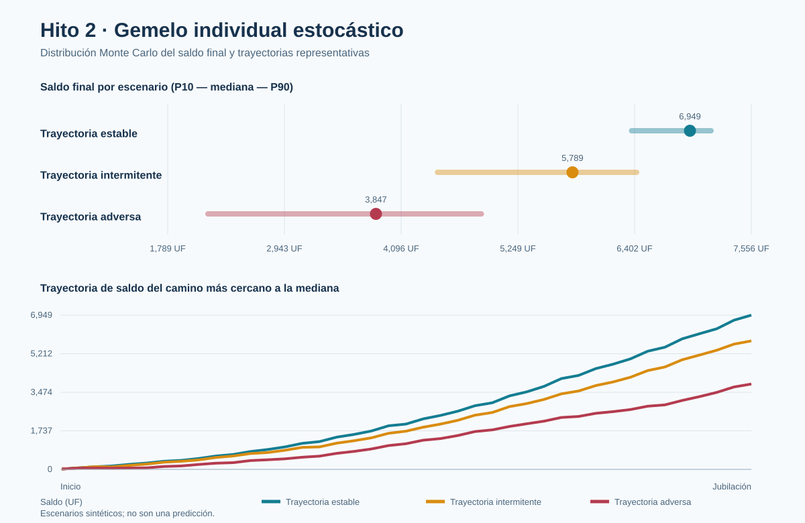

# Hito 2 · Gemelo digital individual estocástico

Primera versión reproducible del segundo hito. Simula trayectorias laborales mensuales desde la edad inicial hasta la jubilación mediante una cadena de Markov y compara al menos tres escenarios con Monte Carlo.

## Resultado principal

| Escenario | Mediana saldo final | P10 | P90 | Densidad mediana | Brecha pareada mediana | Bajo estable pareado |
|---|---:|---:|---:|---:|---:|---:|
| Trayectoria estable | 6,949.2 UF | 6,372.3 | 7,158.0 | 95.0% | 0.0 UF | 0.0% |
| Trayectoria intermitente | 5,789.0 UF | 4,455.5 | 6,422.1 | 78.3% | -1,027.2 UF | 98.5% |
| Trayectoria adversa | 3,846.5 UF | 2,187.1 | 4,888.2 | 50.6% | -2,950.0 UF | 99.7% |



## Interpretación correcta

Las diferencias muestran cómo cambian los saldos sintéticos cuando solo se modifican las probabilidades de transición laboral. Todos los escenarios comparten perfil inicial, crecimiento salarial, mercado, semilla y regla proxy de fondos. La brecha pareada compara la misma extracción uniforme con su contraparte estable.

Las probabilidades no están calibradas con HPA: son supuestos transparentes de escenarios. Los fondos A–E son proxies, el mercado es determinista y el resultado no predice pensiones individuales ni representa a Chile.

## Reproducir

```powershell
gemelo-previsional hito2 --config config/hito2.json --output-dir examples/hito2
```

Consulte `docs/MILESTONE2.md` para la metodología y `hito2_summary.json` para el manifiesto completo.
